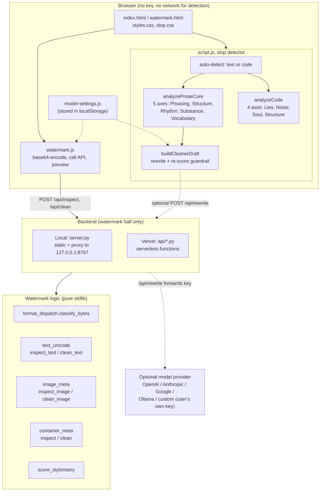

# Architecture and build guide

## What this app does

Two tools that share a shell.

**The AI slop detector** does not guess who wrote something. It measures the
writing for slop: generic phrasing, hollow structure, unfinished code, invisible
markers. It scores text and code from 0 to 100, splits that score into named
axes so the breakdown is the reason for the number, and can rewrite prose to
remove the slop it found. Every part of it runs in the browser. No server, no
model, no key.

**The AI watermark remover** strips things you cannot see: invisible Unicode,
space homoglyphs, AI provenance metadata, and C2PA marks, from pasted text or
uploaded files. This half calls a small Python backend that is pure standard
library.

## System diagram



The important line in that diagram is the one that is missing: the slop detector
never talks to the backend. Detection and the local cleaner are entirely
client-side. The backend exists only for the watermark half and for the optional
model rewrite.

## Two deployment shapes, one logic

The watermark logic is written once and driven two ways.

- **Local** (`server.py`): a stdlib HTTP server serves the static files and
  proxies `/api/*` to the vendored fork's own service on `127.0.0.1:8767`, which
  it spawns as a subprocess.
- **Vercel** (`api/*.py`): there is no subprocess. Each route is a serverless
  function that imports the vendored modules (bundled under `api/_wm/`) and calls
  them directly. `api/_wm_service.py` is the shared adapter; `api/scan.py`,
  `clean.py`, `health.py`, `capabilities.py`, and `rewrite.py` are the routes.

`/api/inspect` maps to `api/scan.py` through a rewrite in `vercel.json`, because
a file literally named `inspect.py` would shadow Python's standard-library
`inspect` module once the `api` directory is on the path.

## How the slop score works

The score is not a single opaque number. Each axis contributes points, and the
points add up to the score. So the breakdown is always the reason for the
number, and you fix the tallest bar first.

**Text**, five axes:

| Axis | Catches |
| --- | --- |
| Phrasing | cliche openers, hype, stock AI phrases, importance puffery, weasel attribution |
| Structure | rhetorical frames: "it is not X, it is Y", faux insight, colon reveals, fake-profound endings |
| Rhythm | flat sentence-length variance, staccato runs, punctuation cadence (by density, not presence) |
| Substance | concrete detail (numbers, names, dates) against abstract nouns |
| Vocabulary | corporate verbs, empty adjectives, lexical diversity, synonym cycling |

**Code**, four axes (Lies, Noise, Soul, Structure), covering placeholders and
stubs, mutable default arguments, debug noise, inflated comments, and
cross-language idiom leakage.

Bands: under 30 CLEAN, 30 to 49 SUSPICIOUS, 50 to 69 INFLATED_SIGNAL, 70 and up
CRITICAL_DEFICIT.

## Build one yourself, step by step

A weekend, no dependencies. Plain HTML and JavaScript on the front, Python
standard library on the back.

### 1. Patterns and weights first

Start with a list of regexes, each with a weight and a one-line reason. Ship
this alone and it is already useful.

```js
const SLOP_PATTERNS = [
  { type: "cliche opener",
    pattern: /\bin (?:today's|the)\s+(?:(?:fast[- ]paced|digital|modern)\s+){1,3}(?:world|landscape|era)\b/gi,
    weight: 10, note: "Synthetic setup that rarely adds evidence." },
  // ...
];
```

Two lessons hide here. Allow **stacked adjectives** ("in today's fast-paced
*digital* landscape"), or the flagship cliche slips through. And match verbs in
**every inflected form** (empower, empowers, empowering), or half the hits are
missed.

### 2. Add the measurements that need no word list

Detail density (count numbers, names, dates), sentence-length variance, and
lexical diversity. These catch the slop your list has never seen. Use a
moving-average measure (MATTR) for diversity, not unique-over-total, because the
naive ratio falls as any document gets longer no matter how well written.

### 3. Split the score into axes

Group the signals, sum each group, and show the groups. Same math, but now the
result tells the reader what to fix instead of handing them a number.

### 4. Threshold the noisy signals

Em dashes, quote marks, hyphens, tricolons. Fire on **density**, not presence,
and make the thresholds scale with length, or you flag every real essay. Strip
markdown before scoring so bullets and table rules do not read as stray dashes.

### 5. Add a cleaner, and guard it

If you rewrite, the one rule that matters is that the cleaner must never hand
back text that scores worse than the input. Clean paragraph by paragraph to keep
structure, re-score the draft, and if it is not strictly cleaner, return the
original with a note. Never invent facts: when you delete an empty claim, list
the gap for the writer to fill.

### 6. Add the watermark scanner, context aware

A set of invisible codepoints, a decision per character, and neighbor rules.
The naive strip-everything loop corrupts real text: a zero-width joiner after an
emoji base holds a family emoji together, a zero-width non-joiner inside Arabic
is spelling, a tag character inside a complete flag sequence is load-bearing.
Same codepoint, opposite verdict, depending on what sits next to it.

### 7. Wrap the backend so it runs anywhere

Keep the watermark logic as plain functions (`inspect_text`, `clean_text`,
`inspect_image`, ...). Then a local server can proxy to it and a serverless
function can import and call it directly, with no change to the logic.

## What it deliberately cannot do

Statistical token-sampling watermarks, the kind embedded in text at generation
time, are not detectable by rules. The `/api/capabilities` route says so:

```json
{ "scorers": { "synthid": false, "stylometry": true },
  "harnesses": { "markllm": false } }
```

Invisible characters and metadata are fully solvable with the standard library.
Statistical watermarking is not, and any tool that claims otherwise is guessing.

## Three rules that keep it honest

- Never claim authorship. Report signals, not verdicts about people.
- Show your work. If the tool cannot tell you why, do not trust the number.
- Test it against good human writing before you trust it against slop.

## Credits for the checks

- Four-axis code scoring and cross-language leakage:
  [rsionnach/sloppylint](https://github.com/rsionnach/sloppylint)
- Structural prose patterns:
  [petergyang/no-ai-slop](https://github.com/petergyang/no-ai-slop)
- Multi-dimension scoring rubric:
  [hardikpandya/stop-slop](https://github.com/hardikpandya/stop-slop)
- Code-mode framing:
  [flamehaven01/AI-SLOP-Detector](https://github.com/flamehaven01/AI-SLOP-Detector)
- Watermark backend (vendored fork of):
  [guillaumemeyer/watermarks-remover](https://github.com/guillaumemeyer/watermarks-remover)
